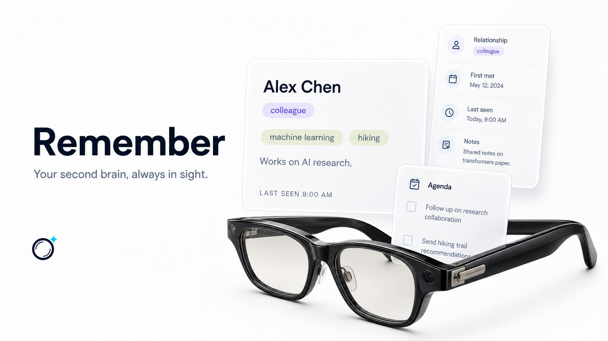
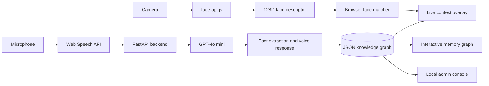

<p align="center">
  
</p>

<h1 align="center">Remember</h1>

<p align="center">
  <strong>Your second brain, always in sight.</strong><br />
  Smart-glasses software that recognizes people, captures conversational context, and turns everyday encounters into a personal memory graph.
</p>

<p align="center">
  <a href="#quick-start"></a>
  
  
  
  
</p>

<p align="center">
  
</p>

> [!NOTE]
> Remember won **1st place at the Replit Agent Hackathon**. This repository is the working prototype: browser-side perception, speech capture, persistent memory, voice recall, and face-linked context cards.

## What is Remember?

Remember is an assistive-memory prototype for smart glasses. It runs face recognition in the browser, overlays useful context beside recognized people, listens for facts worth retaining, and stores those memories in a personal knowledge graph. The user can later ask questions by voice or inspect relationships and shared topics visually.

The project is designed around one idea: the interface should surface the right memory at the moment it becomes useful, without replacing the human interaction taking place underneath it. Recognized people receive quiet, frosted context cards containing only the relationship, topics, notes, and encounter history that matter in the moment.

## Four AI workflows

| Workflow | What happens |
| --- | --- |
| **Recognize** | `face-api.js` detects faces, computes 128-dimensional descriptors, and matches them against enrolled identities in the browser. |
| **Listen** | The Web Speech API continuously transcribes speech and pauses after a completed utterance. |
| **Remember** | GPT-4o mini extracts new topics, notes, and explicitly stated relationships before updating the person's persistent record. |
| **Recall** | A voice query retrieves context from the knowledge graph, answers naturally, and can add, replace, remove, or clear agenda items. |

Recognized faces receive a live overlay containing the person's name, relationship, topics, notes, and last-seen time. Unknown faces can be enrolled from the camera or introduced naturally in conversation.

## Architecture



The perception loop remains in the browser. The backend owns fact extraction, voice-query orchestration, agenda operations, and persistence.

## Quick start

### Requirements

- Python 3.10+
- Node.js 18+ with `npx`
- Chrome or another Chromium browser with Web Speech API support
- Webcam and microphone access
- An OpenAI API key

### 1. Clone and install

```bash
git clone https://github.com/Fiyxxx/remember.git
cd remember

python3 -m venv backend/venv
source backend/venv/bin/activate
pip install -r backend/requirements.txt

cp backend/.env.example backend/.env
```

Set your key in `backend/.env`:

```dotenv
OPENAI_API_KEY=your_openai_key_here
```

### 2. Download the face-model weights

The repository tracks the model manifests but ignores the binary weights. Download the matching files into `frontend/models/`:

```bash
curl -L https://raw.githubusercontent.com/vladmandic/face-api/master/model/tiny_face_detector_model.bin \
  -o frontend/models/tiny_face_detector_model.bin
curl -L https://raw.githubusercontent.com/vladmandic/face-api/master/model/face_landmark_68_tiny_model.bin \
  -o frontend/models/face_landmark_68_tiny_model.bin
curl -L https://raw.githubusercontent.com/vladmandic/face-api/master/model/face_recognition_model.bin \
  -o frontend/models/face_recognition_model.bin
```

### 3. Run both services

```bash
chmod +x start.sh
./start.sh
```

Open the following local surfaces:

| Surface | URL |
| --- | --- |
| Smart-glasses simulator | [localhost:3000](http://localhost:3000) |
| Memory graph | [localhost:3000/graph.html](http://localhost:3000/graph.html) |
| Admin console | [localhost:3000/admin.html](http://localhost:3000/admin.html) |
| Interactive API docs | [localhost:8000/docs](http://localhost:8000/docs) |

The browser will request camera and microphone permission. These APIs work on `localhost`; a deployed version must use HTTPS.

## Try the memory loop

1. Look at the camera and select **+** to enroll a new face.
2. Say the person's name or enter it when prompted.
3. Continue the conversation. After a short pause, Remember extracts only new facts worth retaining.
4. Select **Ask AI** and ask something such as, "Who was interested in hiking?"
5. Open the memory graph to inspect people, shared topics, and encounter history.

## API

| Method | Route | Purpose |
| --- | --- | --- |
| `GET` | `/knowledge-graph` | Return people and agenda state. |
| `POST` | `/introduce` | Persist a named identity and its 128D face descriptor. |
| `POST` | `/update-person` | Extract and merge new facts from a transcript. |
| `POST` | `/query` | Answer a question and optionally apply agenda operations. |
| `DELETE` | `/admin/person/{person_id}` | Remove one enrolled identity. |
| `POST` | `/admin/reset` | Clear all enrolled people. |

## Memory model

Each person record is intentionally small and inspectable:

```json
{
  "display_name": "Alex Chen",
  "descriptor": ["128 floating-point values"],
  "relationship": "colleague",
  "topics": ["machine learning", "hiking"],
  "notes": "Works on AI research.",
  "first_met": "2026-04-15",
  "last_seen": "2026-05-03T09:00:00"
}
```

Records are currently stored in `backend/knowledge_graph.json`. Shared topics form the edges in the interactive memory graph.

## Privacy and safety

Remember is a hackathon prototype, not a production deployment for sensitive personal data.

- Camera frames and face matching remain in the browser.
- Face descriptors and extracted memories are stored locally in `backend/knowledge_graph.json`.
- Conversation text and relevant knowledge-graph context are sent to the configured OpenAI API for fact extraction and question answering.
- The current API has no authentication, uses permissive CORS, and stores unencrypted JSON on disk.
- Obtain informed consent before enrolling or storing information about another person.

Before real-world use, add authentication, encryption at rest, scoped data retention and deletion, explicit recording indicators, consent controls, audit logging, and a proper database.

## Repository layout

```text
remember/
├── backend/
│   ├── main.py                 # FastAPI routes and agenda operations
│   ├── ai.py                   # Fact extraction and voice-query prompts
│   ├── knowledge.py            # Persistent knowledge-graph operations
│   └── knowledge_graph.json    # Local prototype store
├── frontend/
│   ├── app.js                  # End-to-end glasses interaction loop
│   ├── face.js                 # Detection, descriptors, and enrollment
│   ├── speech.js               # Continuous browser transcription
│   ├── overlay.js              # Live face-linked memory cards
│   ├── graph.html / graph.js   # Interactive memory graph
│   └── admin.html              # Local data-management console
├── showcase/                   # Product showcase built with Next.js and Three.js
├── docs/assets/                # README visuals
└── start.sh                    # Local backend and frontend launcher
```

## Current limitations

- Recognition depends on browser camera quality and a single stored descriptor per person.
- Speech recognition support varies by browser and may use browser-vendor services.
- The backend keeps the knowledge graph in process and writes to a single JSON file.
- Model responses are validated as JSON, but there is no schema-retry or moderation pipeline.
- The local admin routes are intentionally unauthenticated for the demo.

## Hackathon

Remember was built for the **Replit Agent Hackathon**, where it placed **1st**. The prototype explores how multimodal agents can support human memory through ambient perception, selective consolidation, and timely recall.
